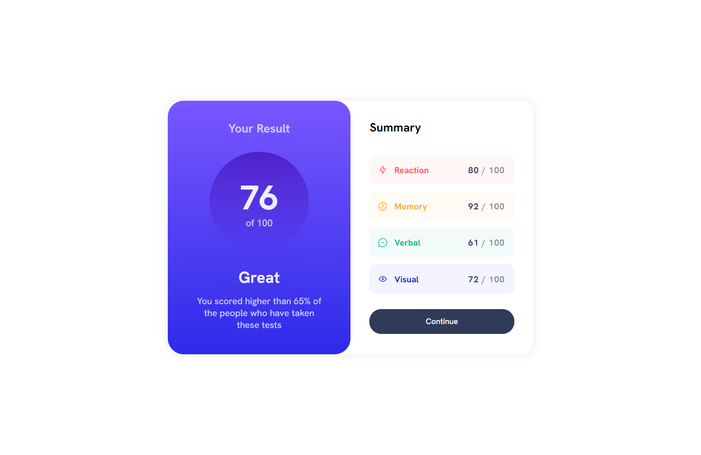

# Frontend Mentor - Results summary component solution

This is a solution to the [Results summary component challenge on Frontend Mentor](https://www.frontendmentor.io/challenges/results-summary-component-CE_K6s0maV). Frontend Mentor challenges help you improve your coding skills by building realistic projects.

## Table of contents

-   [Overview](#overview)
    -   [The challenge](#the-challenge)
    -   [Screenshot](#screenshot)
    -   [Links](#links)
-   [Installation](#installation)
-   [Usage](#usage)
-   [Built with](#built-with)
-   [Features](#features)
-   [Code Quality](#code-quality)
-   [Author](#author)
-   [Acknowledgments](#acknowledgments)

## Overview

### The challenge

Users should be able to:

-   View the optimal layout for the interface depending on their device's screen size
-   See hover and focus states for all interactive elements on the page

### Screenshot




### Links

-   Solution URL: [https://github.com/vishwa-akshat/results-summary](https://github.com/vishwa-akshat/results-summary)
-   Live Site URL: [https://results-summary-beige.vercel.app/](https://results-summary-beige.vercel.app/)

## Installation

To get started, clone the repository and run the following command:

```bash
  npm install
```

## Usage

Once the installation is complete, run the following command to start the development server:

```bash
  npm start
```

Then open http://localhost:3000 to view it in the browser.

### Built with

-   React - JS library
-   Sass - CSS pre-processor
-   Flexbox
-   CSS Grid
-   Create React App - React application bootstrap
-   Clean Code Principles

### Features

-   Responsive design
-   Hover and focus states for all interactive elements
-   Accessible
-   Clean and modular Sass code
-   Well-organized component structure
-   Cross-browser compatibility

### Code Quality

The code in this project is organized using the clean code principles. The project has a well-structured component architecture and all code is formatted using Prettier. Additionally, the code is checked using ESLint for any errors or warnings.

## Author

-   Website - [Akshat Vishwakarma](http://akshat-dev.vercel.app/)
-   Frontend Mentor - [@vishwa-akshat](https://www.frontendmentor.io/profile/vishwa-akshat)
-   Twitter - [@akshatVis](https://www.twitter.com/akshatVis)

## Acknowledgments

I would like to thank Frontend Mentor for providing this challenge, which has allowed me to improve my coding skills.
